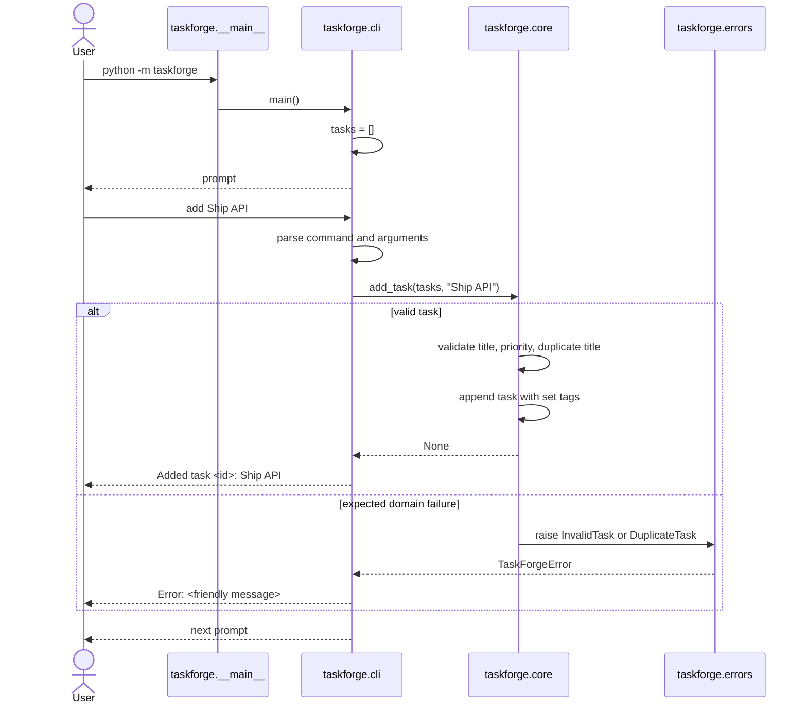
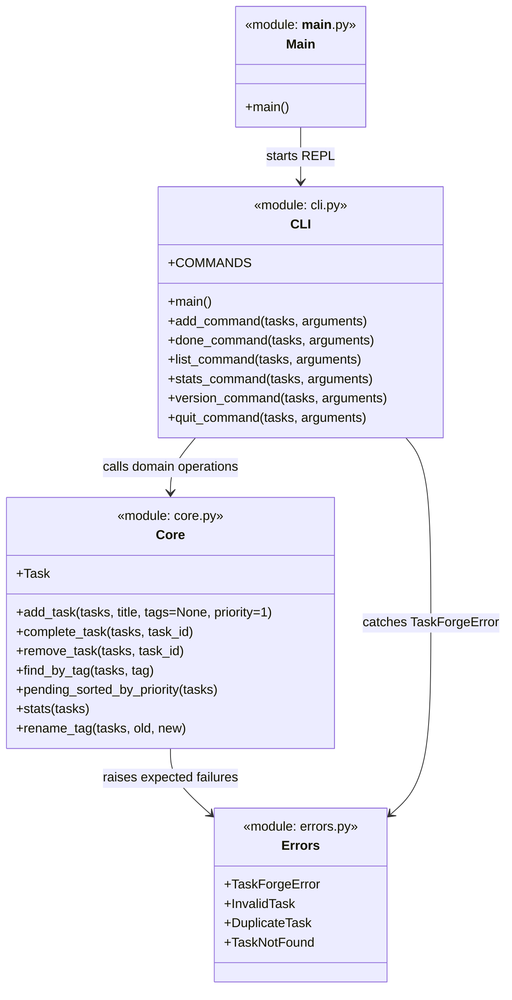
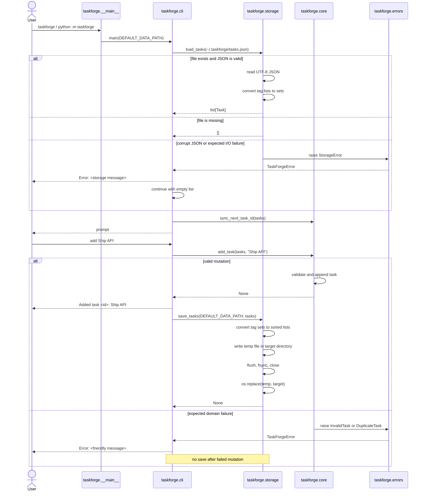
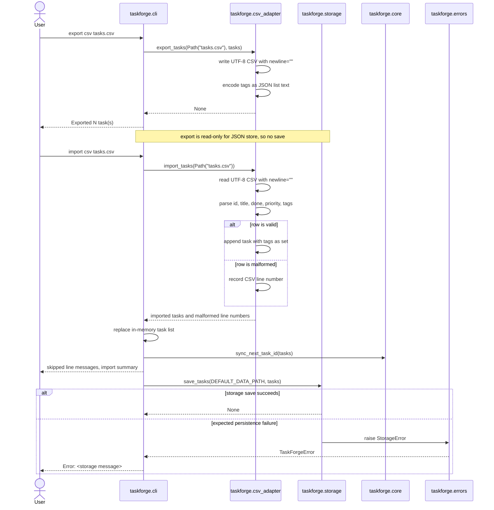
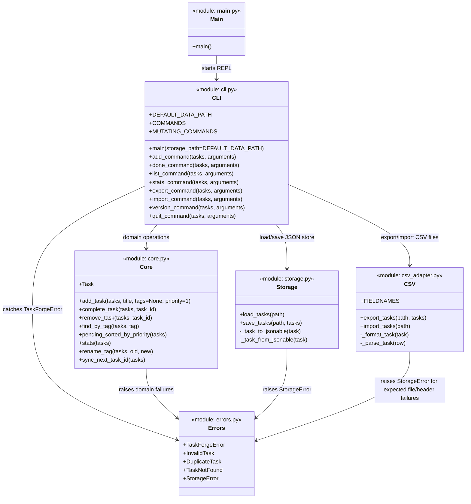

# TaskForge Architecture Diagrams

This document captures the TaskForge architecture immediately before Phase 6
and after the Phase 6 persistence/CSV changes.

## Before Phase 6: Phase 5 architecture

Phase 5 had an in-memory REPL. The CLI owned user interaction and friendly
error reporting. The core owned task rules and raised typed domain errors.
There was no durable storage boundary.

Dependency direction:

```text
__main__ → cli → core → errors
```

### Sequence diagram: add a task before Phase 6



### Class/module diagram before Phase 6



## After Phase 6: durable JSON persistence and CSV interchange

Phase 6 added adapters around the in-memory domain model. The core remains
free of filesystem, JSON, CSV, input, and printing concerns. The CLI now
decides when to load and save. Storage and CSV adapters own serialization and
file behavior.

Dependency direction:

```text
__main__ → cli → core
              ├→ storage → errors
              ├→ csv_adapter → errors
              └→ errors
```

### Sequence diagram: REPL startup and successful mutation after Phase 6



### Sequence diagram: CSV export/import after Phase 6



### Class/module diagram after Phase 6



## Key architectural change in Phase 6

The important change is the new adapter boundary:

- `core.py` still only manages task rules and in-memory task dictionaries.
- `storage.py` owns durable JSON persistence and atomic writes.
- `csv_adapter.py` owns CSV-specific formatting/parsing.
- `cli.py` coordinates user commands, load/save timing, and expected-error
  reporting.
- `errors.py` remains the shared expected-failure vocabulary, extended with
  `StorageError`.
