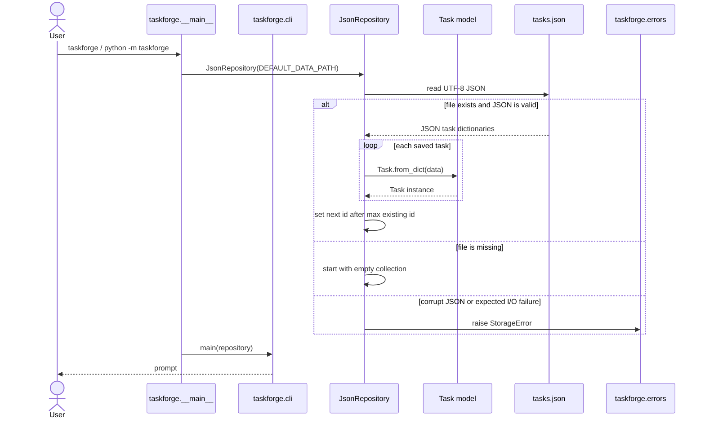
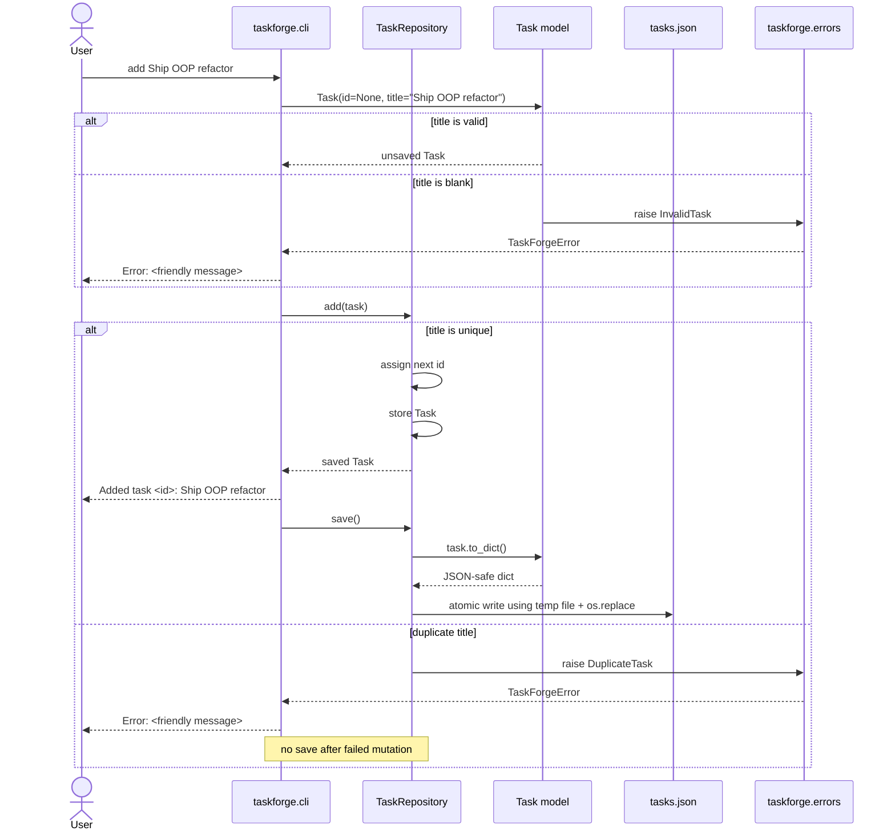
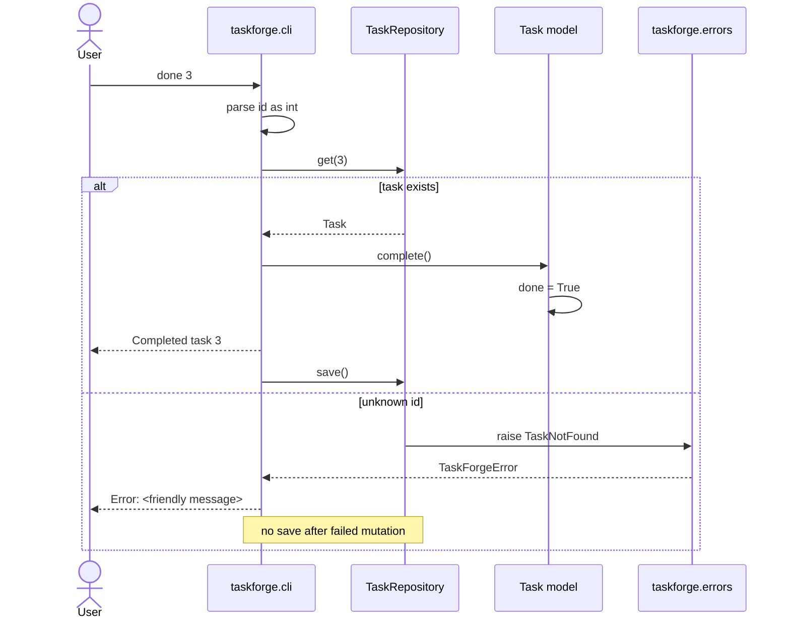
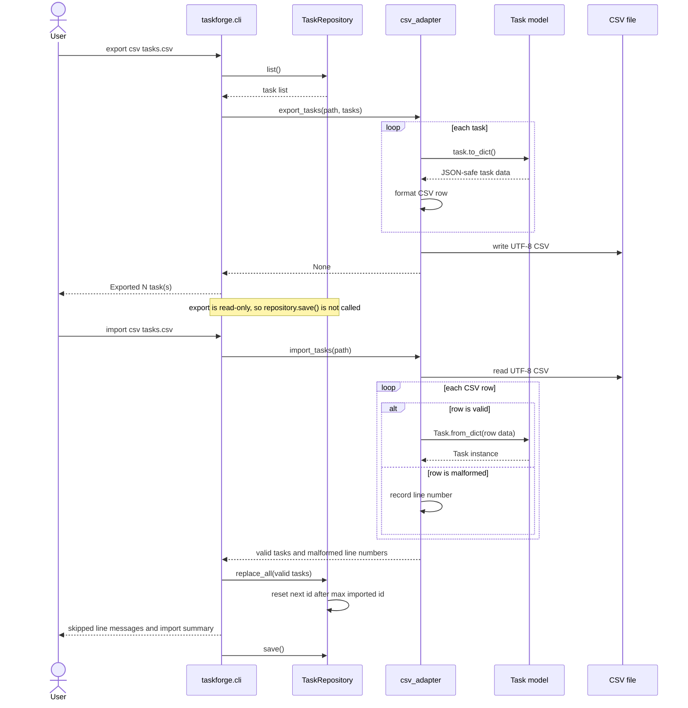
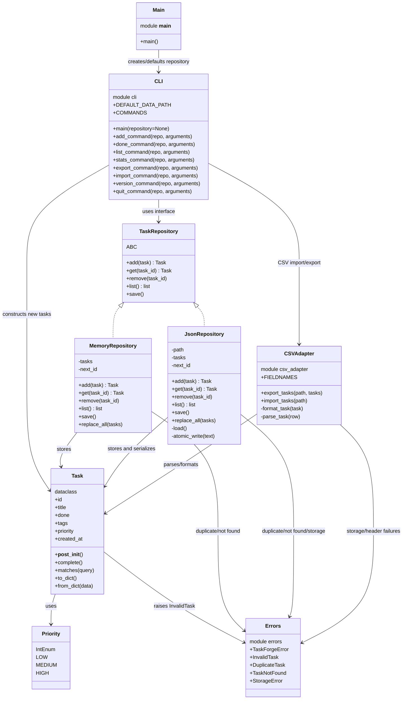

# TaskForge Phase 7 Design Diagrams

This document describes the target architecture for TaskForge Phase 7
(`v0.3a`). It is a design target, not the current implementation until the
Phase 7 refactor is completed.

## Layer diagram

Phase 7 introduces an object-oriented domain model and a repository boundary.
The CLI stops owning a raw `list[dict]` and instead talks to a repository
interface.

```mermaid
flowchart TD
    User[User]
    Main[taskforge.__main__]
    CLI[taskforge.cli]
    RepoABC[TaskRepository interface]
    MemoryRepo[MemoryRepository]
    JsonRepo[JsonRepository]
    CSV[csv_adapter]
    Model[models Task and Priority]
    Errors[errors]
    JSONFile[(tasks.json)]
    CSVFile[(user CSV file)]

    User --> Main
    Main --> CLI
    CLI --> RepoABC
    RepoABC -.implemented by.-> MemoryRepo
    RepoABC -.implemented by.-> JsonRepo
    MemoryRepo --> Model
    JsonRepo --> Model
    JsonRepo --> JSONFile
    CLI --> CSV
    CSV --> Model
    CSV --> CSVFile
    Model --> Errors
    MemoryRepo --> Errors
    JsonRepo --> Errors
    CSV --> Errors
    CLI --> Errors
```



Dependency rule:

```text
__main__ → cli → repository → models → errors
              └→ csv_adapter → models/errors
```

`core.py` should no longer be the primary domain layer. It may be removed or
kept only as a documented compatibility wrapper.

## Sequence diagram: CLI startup with `JsonRepository`



## Sequence diagram: successful `add` command



## Sequence diagram: `done` command



## Sequence diagram: CSV export/import



`replace_all()` is not listed in the minimal roadmap interface, but Phase 6
already uses replacement semantics for CSV import. Phase 7 should either add
this repository method explicitly or implement the same behavior through a
documented repository operation. Adding an explicit method is cleaner because
the CLI should not mutate repository internals.

## Class/module diagram



## Responsibilities by layer

| Layer | Module | Responsibility |
|---|---|---|
| Entry point | `__main__.py` | Start the app and select the default repository implementation. |
| Interface | `cli.py` | Parse commands, print output, catch expected `TaskForgeError` failures. |
| Repository | `repository.py` | Own task collections, assign IDs, enforce collection-level rules, persist when needed. |
| Domain model | `models.py` | Represent one task, protect task invariants, serialize/deserialize task data. |
| Interchange | `csv_adapter.py` | Convert between `Task` objects and stable CSV rows. |
| Error vocabulary | `errors.py` | Define expected failures shared across layers. |

## Main design decisions

- `Task` protects per-task invariants: valid title, valid priority, tag default
  isolation, completion behavior.
- Repository classes protect collection invariants: unique titles, known IDs,
  ID assignment.
- `JsonRepository` owns JSON persistence and atomic writes. The CLI should not
  know JSON details.
- CSV remains an adapter, not the canonical persistence store.
- CSV import should replace the repository contents using an explicit
  repository operation such as `replace_all(tasks)`.
- `TaskRepository` enables dependency inversion: tests can use
  `MemoryRepository`, while the real CLI uses `JsonRepository`.
